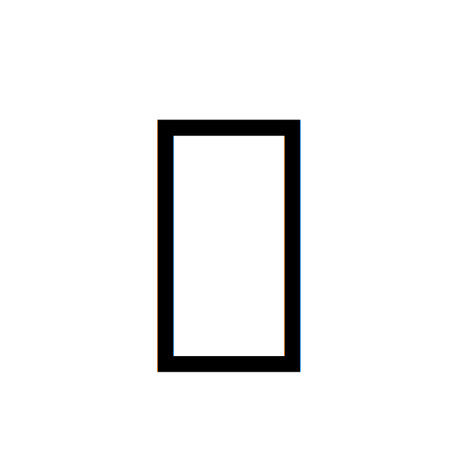

<div align="center">

# Kage Script (影文字)

*A modern translator for the 17th-century Japanese Shinobi cipher.*
<a href="https://www.producthunt.com/products/kage-3?embed=true&amp;utm_source=badge-featured&amp;utm_medium=badge&amp;utm_campaign=badge-kage-4" target="_blank" rel="noopener noreferrer"></a>

Convert any language into **忍びいろは (Shinobi Iroha)**, the historical ninja cipher documented in the **1676 Bansenshūkai (萬川集海)**.

<p>

</p>


</div>

---

## About

**Kage Script** is a modern web application that translates text into the authentic **Shinobi Iroha cipher**, a secret writing system used by Japanese ninja and described in the **Bansenshūkai (1676)**.

Unlike simple substitution ciphers, the original Shinobi system relies on kana conversion and historical kanji mappings. This project faithfully reproduces that process while providing a modern, responsive interface.

---

## Features

- Translate **any language** into Shinobi script
- Decode Shinobi text back into readable text
- Supports up to **2,000 characters**
- Invisible Unicode steganography mode
- Historically accurate cipher implementation
- Clean monochrome interface inspired by Japanese minimalism
- Responsive design for desktop and mobile
- Dark mode support
- Fast client-side experience

---

## Example

```
Hello World

↓

𣘸⾝⻩熿⼟⾊...
```

---

## Tech Stack

- React 19
- TanStack Start
- TypeScript
- Tailwind CSS v4
- TanStack Query
- Bun
- Lovable AI Gateway (Hiragana conversion)

---

## Project Structure

```
src/
 ├── routes/
 ├── components/
 ├── lib/
 ├── styles/
 └── utils/
```

---

## Getting Started

### Clone

```bash
git clone https://github.com/Wake4188/kage-script.git

cd kage-script
```

### Install

```bash
bun install
```

### Start development server

```bash
bun run dev
```

Open

```
http://localhost:8080
```

---

## Production

Build:

```bash
bun run build
```

Preview:

```bash
bun run start
```

---

## Deployment

The project can be deployed on:

- Vercel
- Netlify
- Cloudflare Pages
- Any Node-compatible platform

For Vercel, configure:

```
LOVABLE_API_KEY=your_key_here
```

and use the appropriate Nitro/Vercel preset.

---

## Historical Background

The **Shinobi Iroha cipher** appears in the **Bansenshūkai (萬川集海)**, a comprehensive ninja manual compiled in **1676** during Japan's Edo period.

Rather than inventing a fictional "ninja alphabet", Kage Script reproduces the documented encoding process using historical character mappings.

This project is based on the research and implementation from **tomill/Text-Shinobi**, adapted and expanded into a modern web application.

---

## Credits

Created by **Noa Wilhide**

Original cipher research and mappings:

https://github.com/tomill/Text-Shinobi

---

## License

Released under the **MIT License**.

See the `LICENSE` file for details.
